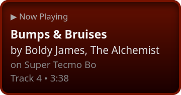

# Muffled

Muffled is a simple service that gets the music you're listening to from [ListenBrainz](https://listenbrainz.org/) and exposes the status of what is currently playing via [Server Sent Events](https://developer.mozilla.org/en-US/docs/Web/API/Server-sent_events/Using_server-sent_events) as well as an `<iframe>` that you can embed on your website, which looks like this by default:



Note that SSE works best when HTTP/2 or newer is being used.

ListenBrainz itself connects to various services, such as Spotify, Apple Music, Last.FM, or your own Navidrome instance.
If you're logged in, see [ListenBrainz third-party music services](https://listenbrainz.org/settings/music-services/details/).

## Configuration

Example `muffled.toml`:

```toml
user = "your_username"
address = "localhost:8080"
log_level = "info"
interval = 120 # Don't set this too low if you're using the default instance
listenbrainz_base_url = "https://api.listenbrainz.org/1"
widget_path = "/path/to/widget.html" # If you want to use custom HTML, CSS, and JS
```
